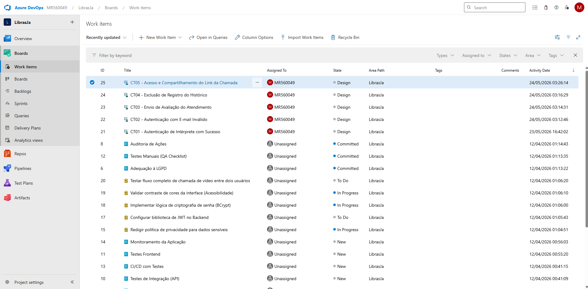
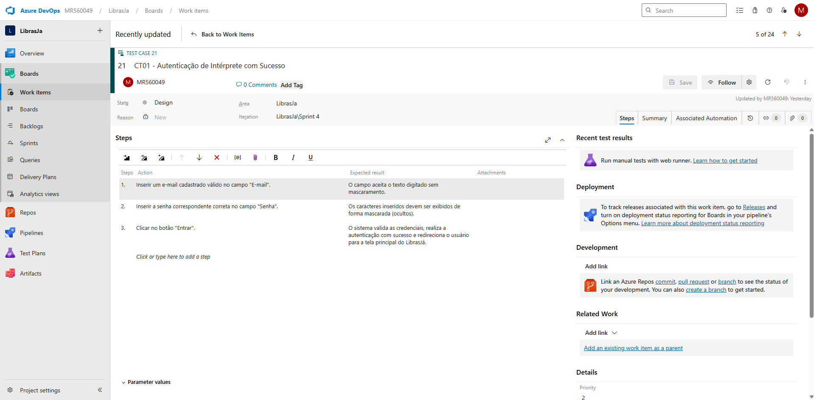

# 📋 Parte A - Testes Manuais (Azure Boards)

Os testes manuais para o MVP do LibrasJá foram documentados no Azure DevOps, cumprindo os requisitos de rastreabilidade e detalhamento de Ação vs Resultado Esperado exigidos na Sprint.

### 🔐 Variáveis e Dados Controlados (Inputs)
Conforme exigência, os testes utilizaram dados controlados para a validação dos fluxos:
* **Usuário válido (CT01):** `ivanildo_sl@hotmail.com`
* **Senha válida:** `123456`
* **E-mail inválido (CT02):** Inserção de formato incorreto para forçar o bloqueio e validar o tratamento de erros do front-end.

### 🗂️ Fluxos Mapeados
Foram mapeados 5 fluxos principais:
* **CT01** - Autenticação com Sucesso
* **CT02** - Autenticação com E-mail Inválido
* **CT03** - Envio de Avaliação do Atendimento
* **CT04** - Exclusão de Registro do Histórico
* **CT05** - Acesso e Compartilhamento do Link da Chamada

🔗 **[CLIQUE AQUI PARA ACESSAR O QUADRO NO AZURE BOARDS](https://dev.azure.com/MR560049/LibrasJa/_workitems/recentlyupdated/)**

### 📸 Evidências da Documentação
Para garantir a rastreabilidade caso haja instabilidade de acesso ao Azure, seguem os prints evidenciando a criação dos itens e o detalhamento estrutural dos passos de teste:

